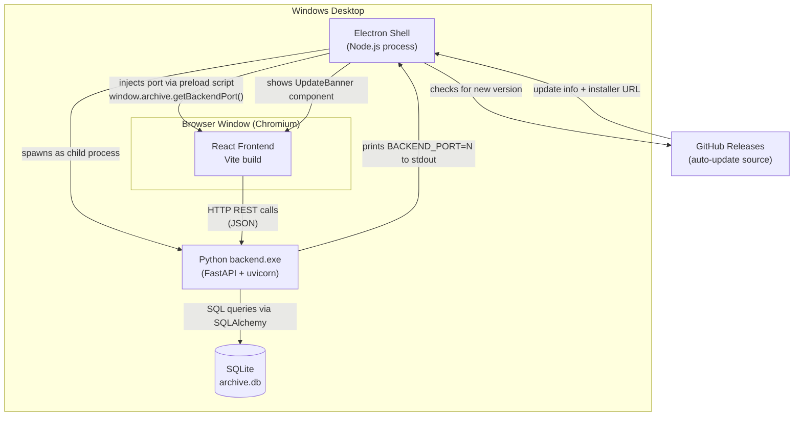
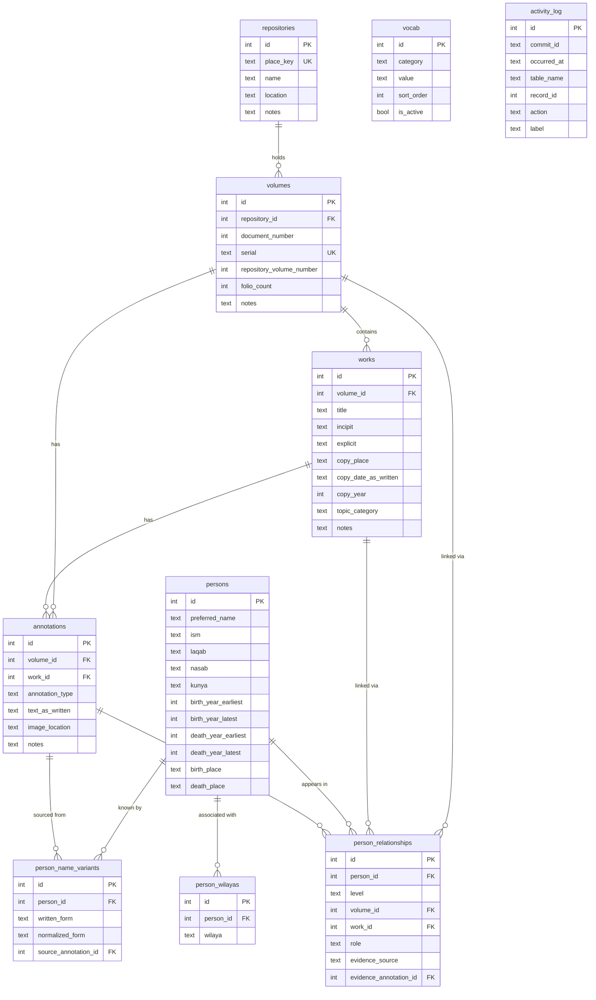

# Project Map: Irfan Archive (أرشيف عرفان)

> Generated 2026-07-02 by codebase-explorer. Regenerate any time — this file is disposable.

A desktop app for one researcher cataloging ~400 Omani manuscript volumes and tracing Islamic scholars across them. It is a three-layer system: an Electron shell (the desktop window), a React frontend that the user actually sees, and a Python web server that runs quietly in the background managing the database. All three are bundled into a single Windows installer.

## 1. Tech stack

| Tool | What it is | Why this project uses it |
|------|-----------|--------------------------|
| **Electron** | Framework for building desktop apps with web tech (HTML/CSS/JS). Wraps a Chromium browser window. | Lets you write the UI in React (web code) while still getting a real desktop app with file access, auto-updates, and no browser tab needed. |
| **React + TypeScript** | React is a UI library for building interactive interfaces. TypeScript adds type annotations to JavaScript so the editor can catch mistakes. | The whole interface is built as React components. TypeScript prevents bugs like passing a number where the API expects a string. |
| **Vite** | Build tool that compiles TypeScript/React into plain JavaScript the browser can run. | Faster than older tools like Webpack. Also handles the dev server for live-reload during development. |
| **Python FastAPI** | A modern Python web framework for building APIs quickly. | The backend runs as a mini web server (an API) that the React frontend talks to over HTTP. FastAPI generates API docs automatically and validates request/response shapes. |
| **uvicorn** | A lightweight Python web server (ASGI server) that runs FastAPI. | FastAPI needs a server to actually listen for HTTP requests; uvicorn is the standard choice. |
| **SQLAlchemy** | A Python library for talking to databases using Python objects instead of raw SQL. | Lets you write `session.get(Volume, id)` instead of `SELECT * FROM volumes WHERE id = ?`. Also manages connections and transactions. |
| **Alembic** | A database migration tool that works with SQLAlchemy. | When the schema changes (adding a column, dropping a field), Alembic records the change as a versioned script so the database can be upgraded without losing data. |
| **SQLite** | A file-based relational database. The entire database is a single `.db` file. | Perfect for a single-user desktop app — no server process needed, the database is just a file in `AppData`. |
| **rapidfuzz** | A Python library for fuzzy string matching (finding strings that are similar but not identical). | Arabic names are spelled many ways across manuscripts. rapidfuzz finds "ابن سعيد" even if the user types "ابن سعد". |
| **PyInstaller** | Packages a Python script + all its dependencies into a single `.exe` file. | End users don't have Python installed. PyInstaller bundles everything so `backend.exe` just runs. |
| **electron-updater** | Library for pushing over-the-air updates to installed Electron apps. | When a new version is published to GitHub Releases, the running app detects it and shows an update banner to the researcher — no manual reinstall needed. |
| **uv** | A fast Python package manager (alternative to pip). | Manages the backend's Python dependencies and virtual environment. |

## 2. Architecture

**How startup works:** Electron spawns `backend.exe`, reads its stdout until it sees `BACKEND_PORT=8765` (or whatever free port the OS assigned), then injects that port number into the React app via a preload script (`window.archive.getBackendPort()`). React calls this on startup in [App.tsx:33-42](frontend/src/App.tsx#L33-L42) to configure where to send API requests.

## 3. Data

**Table explanations:**

- **repositories** — A physical library or private collection where manuscripts are held. One row = one repository. `place_key` is a 4-digit code like `0001` that becomes the first half of the serial number.

- **volumes** — One physical manuscript volume. `serial` is `PPPP-DDDD` (repository code + document number), auto-generated and unique. `document_number` is assigned sequentially within a repository and never changed. One repository has many volumes.

- **works** — An individual text bound inside a volume (a volume can contain multiple works). Tracks when and where the text was copied (`copy_year`, `copy_place`). `copy_date_as_written` stores exactly what the manuscript says; `copy_year` is the researcher's interpreted Hijri year. One volume has many works.

- **annotations (قيود)** — Physical inscriptions written on the manuscript pages: ownership marks, reading certificates, dedications. Can belong to the whole volume or to a specific work inside it. One volume has many annotations; one work also has many annotations.

- **persons** — A historical scholar or figure. Arabic names have many components: `ism` (given name), `laqab` (title/epithet), `nasab` (patronymic chain), `kunya` (honorific like أبو...). Birth/death years are stored as ranges (`earliest`/`latest`) because medieval dates are often approximate.

- **person_name_variants** — Every different spelling a person's name appears as across manuscripts. When you search for a person, all their variants are searched. `normalized_form` strips diacritics and unifies letter forms for tolerant matching. One person has many variants.

- **person_wilayas** — Links a person to one or more Omani administrative regions (wilayas). Junction table: one person can belong to many wilayas, and one wilaya has many persons. Sentinel values `"مجهول"` (unknown) and `"خارج عُمان"` (outside Oman) are valid.

- **person_relationships** — The core link between people and manuscripts. `role` is something like مؤلف (author), ناسخ (copyist), مالك (owner). `level` is either `"volume"` or `"work"`, and the corresponding foreign key is set while the other is NULL — enforced by a CHECK constraint. `evidence_annotation_id` links to the annotation that proves the relationship.

- **vocab** — Controlled vocabulary: the dropdown options used throughout the app (annotation types, confidence levels, evidence sources, roles). Managed in the Settings screen.

- **activity_log** — Every create/update/delete is logged here with a `commit_id` (a UUID assigned to the whole HTTP request). Powers the calendar heatmap on the Dashboard. All times stored as UTC; dashboard queries convert to Muscat time (UTC+4) on the fly.

## 4. API calls

| Endpoint | Method | What you send | What you get back | Why it exists |
|----------|--------|---------------|-------------------|---------------|
| `/volumes/repositories` | GET | nothing | list of all repositories | Populates the repository dropdown in the volume form |
| `/volumes/repositories` | POST | `{place_key, name, location?, notes?}` | new repository object | Creates a new archive/library record |
| `/volumes/repositories/{id}` | GET | nothing | one repository | Loads a repository for editing |
| `/volumes/repositories/{id}` | PATCH | any subset of repository fields | updated repository | Edits repository details |
| `/volumes/repositories/{id}` | DELETE | nothing | 204 No Content | Removes a repository (blocked if it still has volumes) |
| `/volumes/next-document-number?repository_id=N` | GET | nothing | integer | Suggests the next document number when creating a volume |
| `/volumes` | GET | nothing | list of all volumes | Powers the volume list screen |
| `/volumes` | POST | `{repository_id, folio_count?, notes?, ...}` | new volume with auto-assigned serial | Creates a volume (serial is auto-generated server-side) |
| `/volumes/{id}` | GET | nothing | one volume | Loads a volume for viewing/editing |
| `/volumes/{id}` | PATCH | any subset of volume fields | updated volume | Edits volume metadata |
| `/volumes/{id}` | DELETE | nothing | 204 No Content | Removes a volume (blocked if it has works, annotations, or linked persons) |
| `/works/by-volume/{volume_id}` | GET | nothing | list of works in that volume | Shows all texts inside a specific volume |
| `/works` | POST | `{volume_id, title, copy_year?, ...}` | new work object | Adds a text to a volume |
| `/works/{id}` | GET | nothing | one work | Loads a work for editing |
| `/works/{id}` | PATCH | any subset of work fields | updated work | Edits work metadata (dates, topic, etc.) |
| `/works/{id}` | DELETE | nothing | 204 No Content | Removes a work from a volume |
| `/annotations/by-volume/{volume_id}` | GET | nothing | list of annotations on that volume | Shows all inscriptions on a manuscript |
| `/annotations` | POST | `{volume_id, annotation_type, text_as_written?, ...}` | new annotation | Records a physical inscription on a manuscript |
| `/annotations/{id}` | PATCH | any subset of annotation fields | updated annotation | Edits an annotation |
| `/annotations/{id}` | DELETE | nothing | 204 No Content | Removes an annotation |
| `/persons/search?q=...&limit=N` | GET | nothing | ranked list of `PersonMatch` with scores | Powers the live-search field whenever you type a name anywhere in the app |
| `/persons` | GET | nothing | list of all persons | Powers the persons index screen |
| `/persons` | POST | `{preferred_name, ism?, laqab?, ...}` | new person | Creates a scholar record (also auto-creates a name variant) |
| `/persons/{id}` | GET | nothing | one person with wilayas | Loads a person profile |
| `/persons/{id}` | PATCH | any subset of person fields | updated person | Edits biographical details |
| `/persons/{id}` | DELETE | nothing | 204 No Content | Removes a person (blocked if they have any relationships) |
| `/persons/{id}/variants` | GET | nothing | list of name variants | Shows all recorded spellings for a person |
| `/persons/{id}/variants` | POST | `{written_form, source_annotation_id?, notes?}` | new variant | Adds a new spelling of the person's name |
| `/persons/{id}/wilayas` | GET | nothing | list of wilaya strings | Gets the regions associated with a person |
| `/persons/{id}/wilayas` | PUT | `{wilayas: [...]}` | 204 No Content | Replaces all wilayas for a person (full replace, not append) |
| `/persons/{id}/appearances` | GET | nothing | list of `Appearance` objects | Powers the "where does this person appear?" section in the persons screen |
| `/relationships/by-volume/{volume_id}` | GET | nothing | list of person-volume/work links | Shows all scholars linked to a manuscript volume |
| `/relationships` | POST | `{person_id, level, role, volume_id?, work_id?, ...}` | new relationship | Links a person to a volume or work with a role (author, copyist, etc.) |
| `/relationships/{id}` | DELETE | nothing | 204 No Content | Removes a person-manuscript link |
| `/trace/{person_id}` | GET | nothing | list of `TraceResult` with evidence | Trace screen: shows every manuscript a scholar touched, with supporting evidence |
| `/trace/wilaya?name=...` | GET | nothing | `{scholars, copies, repositories}` | Wilaya trace: all scholars from that region, works copied there, repos located there |
| `/vocab/{category}` | GET | nothing | list of active values | Loads dropdown options (annotation types, roles, etc.) |
| `/vocab/{category}` | POST | `{value}` | 201 Created | Adds a new option to a dropdown |
| `/vocab/{category}/{value}` | DELETE | nothing | 204 No Content | Deactivates a dropdown option |
| `/export/csv` | POST | `{output_dir}` | `{files: [...paths]}` | Exports all data as CSV files to the user's chosen folder |
| `/export/json` | POST | `{output_dir}` | `{file: path}` | Exports everything as a single JSON file |
| `/export/excel` | POST | `{output_dir, researcher_name}` | `{file: path}` | Exports a formatted Excel workbook |
| `/export/pdf-html` | GET | `?researcher=name` | HTML string | Returns styled HTML that Electron renders to PDF |
| `/dashboard/stats` | GET | nothing | `{volumes, works, persons, annotations, repositories}` | Five headline numbers shown on the dashboard |
| `/dashboard/activity` | GET | nothing | 365-day list of `{date, count}` | Calendar heatmap data (one "save session" = 1 count per day) |
| `/dashboard/activity/{date}` | GET | nothing | commits + their entries for that day | Click a day on the heatmap to see exactly what changed |
| `/dashboard/recent` | GET | nothing | last 15 touched records | "Recently edited" feed on the dashboard |
| `/dashboard/actionable` | GET | nothing | `{incomplete_volumes, incomplete_works, weak_evidence, orphan_persons}` | "Things that need attention" counts for data quality |
| `/dashboard/repositories` | GET | nothing | repositories sorted by volume count | Bar showing how many volumes each repository contributes |

## 5. CS concepts in this project

**Client–server model & HTTP** — The React frontend ([frontend/src/api/client.ts:11-35](frontend/src/api/client.ts#L11-L35)) is a client that sends HTTP requests (GET, POST, PATCH, DELETE) to the FastAPI server. The server processes them and sends back JSON. They run as separate processes and communicate only through this standard protocol.

**Relational modeling & normalization** — The database separates data into related tables with foreign keys rather than one big flat table. [backend/src/db/models.py](backend/src/db/models.py) shows this: `volumes` has a `repository_id` foreign key instead of copying the repository name into every row. Junction tables (`person_wilayas`, `person_relationships`) represent many-to-many relationships — one person can have many wilayas, and one wilaya has many persons.

**Database transactions & ACID** — When creating a volume, [backend/src/services/volumes.py:87-172](backend/src/services/volumes.py#L87-L172) uses `BEGIN IMMEDIATE` — a database lock that says "I need to read the current max document number and insert a new row, and nobody else can touch this table in between." This prevents two simultaneous creates from getting the same number. ACID (Atomicity, Consistency, Isolation, Durability) is the name for the guarantee that either the whole transaction succeeds or nothing changes.

**Fuzzy string matching** — [backend/src/services/persons.py:22-87](backend/src/services/persons.py#L22-L87) implements a staged search pipeline using `rapidfuzz`. It tries exact matches first, then prefix matches, then token overlap, then fuzzy scoring using the WRatio algorithm. This handles real-world Arabic name variation where the same scholar is written differently in each manuscript.

**String normalization** — [backend/src/utils/arabic.py](backend/src/utils/arabic.py) strips diacritics (the small marks above/below Arabic letters), unifies hamza variants (أ إ آ → ا), and maps ة → ه and ى → ي before comparing strings. This is why searching for "مسلم" also finds "مُسْلِمٌ" — the search index stores normalized forms, not the originals.

**IPC (Inter-Process Communication)** — Electron and the Python backend are two separate OS processes that need to coordinate. The backend announces its port by printing `BACKEND_PORT=8765` to stdout ([backend/src/main.py:137](backend/src/main.py#L137)). Electron reads its child process's stdout stream and extracts that number. This is a simple, reliable form of IPC that requires no shared memory or sockets between processes.

**Context variables for per-request state** — [backend/src/services/activity.py:16](backend/src/services/activity.py#L16) uses Python's `ContextVar` to store a UUID for each HTTP request. `ContextVar` is special: each concurrent request gets its own copy automatically. This means when 10 requests run at the same time, each one writes to its own `commit_id` without needing locks or passing the ID through every function call.

**Database migrations** — The schema has changed 8 times since the project started. Instead of deleting and recreating the database, [backend/migrations/versions/](backend/migrations/versions/) contains one Python script per change. Alembic applies them in order, upgrading the real database safely. This is how production software handles "the live database already has data and we need to change the table structure."

**Audit logging** — Every create/update/delete writes a row to `activity_log` ([backend/src/db/models.py:183-191](backend/src/db/models.py#L183-L191)). The dashboard heatmap and activity feed are built by querying this log. This is the same pattern used in enterprise software for compliance trails and "who changed what."
